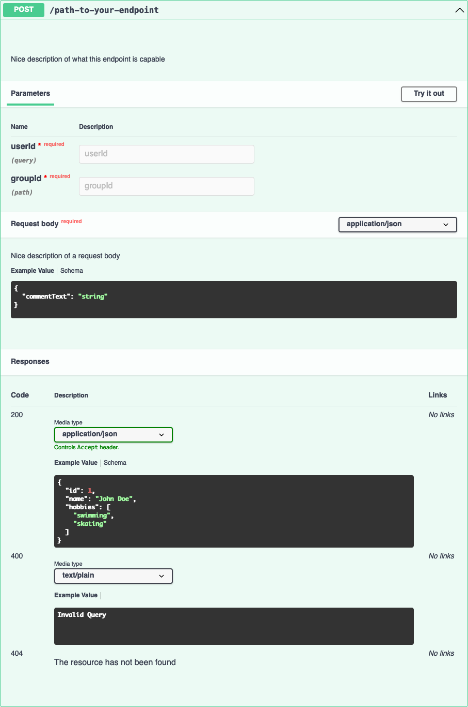

# How to create an API ednpoint?

## 1. Define name

The endpoint name should be written in kebab-lower-case.<br />
This is not a technical requirement but the standard that we should keep.<br />

### Examples
| <span style="color:green">correct</span> | <span style="color:red">incorrect</span> |
|------------------------------------------|------------------------------------------|
| `user`                                   | `User`                                   |
| `get-user-data`                          | `getUserData`                            |
| `post-new-comment`                       | `POST-NEW-COMMENT`                       |

## 2. Create YAML file with endpoint info

This file should be named exactly the same as the endpoint with suffix `swagger.yaml`<br />
To see all available configuration options see this [link](https://swagger.io/docs/specification/about/)
```yaml
paths:
  /path-to-your-endpoint:
    post: # In this indentation level, you have to define the allowed methods
      description: Nice description of what this endpoint is capable
      parameters: # Optional Key - it describes what params are consumed in the endpoint
        - in: query # Informs that the param is located in query string i.e. ?userId=2137
          name: userId
          required: true
        - in: path # Informs that the param is located in query itself i.e. /api/endpoint/{groupId}
          name: groupId
          required: true
      requestBody: # Optional Key - it describes what body are we expecting in the endpoint
        description: Nice description of a request body
        required: true
        content:
          application/json: # Defines content type that we are expecting
            schema:
              type: object
              properties:
                commentText:
                  type: string
                  required: true
      responses: # Defines what statuses are we handling
        200: # HTTP Status number
          content:
            application/json:
              schema:
                $ref: '#/components/schemas/User' # If you don't want to repeat yourself, you can define a reference below
        400:
          content:
            text/plain:
              type: string
              example: Invalid Query
        404:
          $ref: '#/components/responses/404NotFound' # Predefined response, described in /src/types/general.swagger.yaml
components: # Here we can define the refs mentioned above
  schemas:
    User:
      type: object
      properties:
        name:
          type: string
          required: true
        id:
          type: number
          required: true
        hobbies:
          type: array
          required: true
          items:
            type: string
      example: # This example will be shown in docs
        id: 1
        name: John Doe
        hobbies: [ swimming, skating ]
```
### Result


## 3. Generate types for your endpoint
Simply run command `npm run generate-types-from-yaml`. It will generate all swagger docs and based on that, it will
regenerate all types used in API defined by swagger yaml files<br />
They are located in `/src/types/swagger.d.ts`

## 4. Create an actual endpoint
Create a file in `/pages/api` directory with the name of your endpoint i.e. `/pages/api/my-endpoint.ts`.<br />
Inside you can use this boilerplate:
```typescript
import type { NextApiHandler } from 'next';

import { MethodException, methodGuard } from '@/helpers/api/methodGuard';
import type { GetUserResponse } from '@/types/swagger';

const handler: NextApiHandler<GetUserResponse> = async (req, res) => {
  try {
    await methodGuard(req, res, ['POST']);

    /**
     * Your code goes here
     */
    
  } catch (e) {
    if (e instanceof MethodException) {
      res.status(e.status).end(e.message);
      return;
    }

    res.status(500).end(e);
  }
}

export default handler;
```

With this definition `const handler: NextApiHandler<GetUserResponse>` you define params for a handler `req` and `res`
and the response shape - Typescript will throw an error if in `res.json()` param you pass an object with invalid shape.